# 📊 Flowchart - Trainee Dashboard (ฝั่งลูกเทรน)

## 🎯 Overview

เอกสารนี้อธิบาย Flowchart การทำงานของระบบจัดการการฝึกออกกำลังกายฝั่งลูกเทรน (Client Dashboard) ทั้งหมด

---

## 📋 Table of Contents

1. [Main Application Flow](#main-application-flow)
2. [Authentication Flow](#authentication-flow)
3. [Dashboard Overview Flow](#dashboard-overview-flow)
4. [Schedule View Flow](#schedule-view-flow)
5. [Progress View Flow](#progress-view-flow)
6. [Session Cards View Flow](#session-cards-view-flow)
7. [Demo Data Flow](#demo-data-flow)
8. [Error Handling Flow](#error-handling-flow)

---

## 1. Main Application Flow

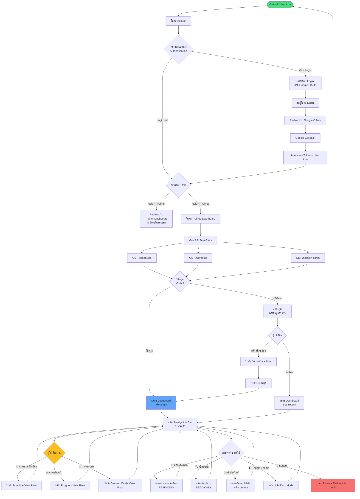

---

## 2. Authentication Flow

```mermaid
flowchart TD
    Start([ผู้ใช้เข้าระบบ]) --> CheckToken{มี Token<br/>ใน localStorage?}
    
    CheckToken -->|ไม่มี| ShowLoginPage[แสดงหน้า Login]
    CheckToken -->|มี Token| ValidateToken{Validate Token<br/>กับ Supabase}
    
    ValidateToken -->|Token หมดอายุ| ShowLoginPage
    ValidateToken -->|Token ใช้งานได้| GetUserData[ดึงข้อมูลผู้ใช้<br/>จาก Supabase]
    
    ShowLoginPage --> DisplayGoogleBtn[แสดงปุ่ม<br/>Sign in with Google<br/>พร้อม Google Icon]
    
    DisplayGoogleBtn --> WaitClick[รอผู้ใช้คลิก]
    WaitClick --> ClickBtn[ผู้ใช้คลิกปุ่ม]
    
    ClickBtn --> InitOAuth[เริ่มต้น Google OAuth 2.0]
    InitOAuth --> RedirectGoogle[Redirect ไป<br/>accounts.google.com]
    
    RedirectGoogle --> GoogleLogin{ผู้ใช้ Login<br/>ที่ Google}
    GoogleLogin -->|ยกเลิก| ShowLoginPage
    GoogleLogin -->|สำเร็จ| GoogleConsent[ขอสิทธิ์เข้าถึงข้อมูล<br/>- Email<br/>- Profile<br/>- Name]
    
    GoogleConsent -->|ปฏิเสธ| ShowError[แสดง Error<br/>ต้องอนุญาตสิทธิ์]
    GoogleConsent -->|อนุญาต| Callback[Google Callback<br/>พร้อม Authorization Code]
    
    ShowError --> ShowLoginPage
    
    Callback --> ExchangeToken[แลกเปลี่ยน Code<br/>เป็น Access Token]
    ExchangeToken --> GetProfile[ดึงข้อมูลโปรไฟล์<br/>จาก Google]
    
    GetProfile --> CreateSupabaseSession[สร้าง Session<br/>ใน Supabase Auth]
    CreateSupabaseSession --> CheckUserExists{ตรวจสอบ User<br/>ใน Database}
    
    CheckUserExists -->|ไม่มี| CreateUser[สร้าง User ใหม่<br/>Role: trainee<br/>Status: active]
    CheckUserExists -->|มีแล้ว| GetUserData
    
    CreateUser --> GetUserData
    
    GetUserData --> CheckRole{ตรวจสอบ Role}
    CheckRole -->|trainee| StoreToken[บันทึก Token<br/>ใน localStorage]
    CheckRole -->|trainer| ShowRoleError[แสดง Error<br/>ระบบนี้สำหรับลูกเทรนเท่านั้น]
    CheckRole -->|อื่นๆ| ShowRoleError
    
    ShowRoleError --> ShowLoginPage
    
    StoreToken --> SetAuthState[ตั้งค่า Auth State<br/>- isAuthenticated: true<br/>- user: userData<br/>- accessToken: token]
    
    SetAuthState --> RedirectDashboard[Redirect ไป<br/>Trainee Dashboard]
    
    RedirectDashboard --> End([เข้าสู่ Dashboard])
    
    style Start fill:#4ade80
    style End fill:#60a5fa
    style ShowRoleError fill:#f87171
    style ShowError fill:#f87171
```

---

## 3. Dashboard Overview Flow

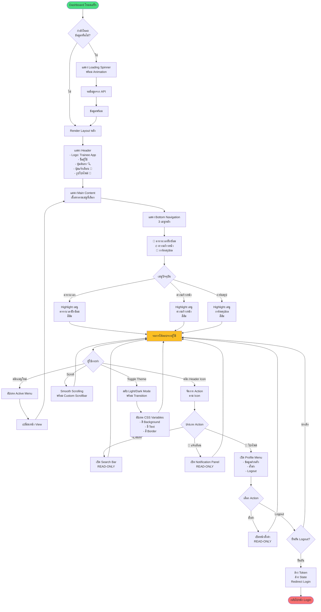

---

## 4. Schedule View Flow

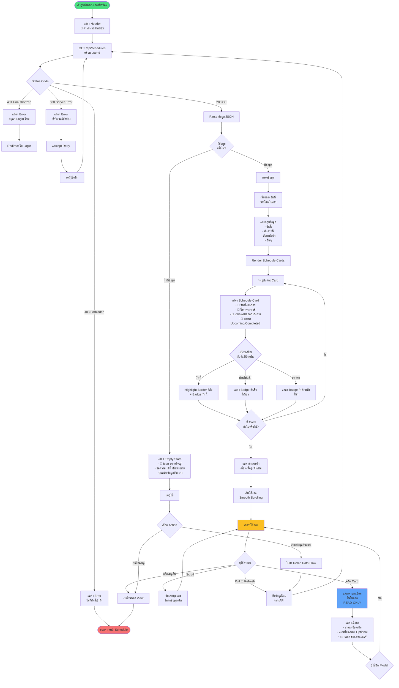

---

## 5. Progress View Flow

```mermaid
flowchart TD
    Start([เข้าสู่หน้าความก้าวหน้า]) --> ShowHeader[แสดง Header<br/>🔥 ความก้าวหน้าของฉัน<br/>ติดตามความก้าวหน้าและสถิติการฝึก]
    
    ShowHeader --> InitTabs[สร้าง Tab Navigation<br/>1. โปรแกรมปัจจุบัน<br/>2. ความก้าวหน้า]
    
    InitTabs --> DefaultTab[เลือก Tab เริ่มต้น<br/>โปรแกรมปัจจุบัน]
    
    DefaultTab --> FetchData[GET /api/workouts<br/>+ Weight History<br/>+ Exercise Stats]
    
    FetchData --> CheckStatus{Status Code}
    
    CheckStatus -->|200 OK| ParseData[Parse ข้อมูล JSON]
    CheckStatus -->|Error| ShowError[แสดง Error Message]
    
    ShowError --> ShowRetry[แสดงปุ่ม Retry]
    ShowRetry --> FetchData
    
    ParseData --> TabSwitch{Tab ที่เลือก}
    
    TabSwitch -->|โปรแกรมปัจจุบัน| ShowProgramTab
    TabSwitch -->|ความก้าวหน้า| ShowProgressTab
    
    ShowProgramTab[แสดง Tab โปรแกรม] --> ProgramCard[แสดง Program Card<br/>- 🏆 ชื่อโปรแกรม<br/>- คำอธิบาย<br/>- ระยะเวลา 12 สัปดาห์<br/>- Progress Bar สัปดาห์ 4/12]
    
    ProgramCard --> ExerciseList[แสดงรายการท่า<br/>แบ่งตามประเภท]
    
    ExerciseList --> WeightTraining[💪 เวทเทรนนิ่ง<br/>สีน้ำเงิน]
    ExerciseList --> Cardio[🏃 คาร์ดิโอ<br/>สีเขียว]
    ExerciseList --> Flexibility[🧘 เฟล็กซ์<br/>สีม่วง]
    
    WeightTraining --> WeightCards[แสดง Exercise Cards<br/>- Squat: 100kg ↑ +5kg<br/>- Push-ups: 20 รอบ ↑ +2]
    
    Cardio --> CardioCards[แสดง Exercise Cards<br/>- Running: 5.2km ⏱️ 27:30<br/>- Cycling: 15km ⏱️ 35:00]
    
    Flexibility --> FlexCards[แสดง Exercise Cards<br/>- Yoga Flow: 30 นาที<br/>- Stretching: 15 นาที]
    
    WeightCards --> ExerciseHistory
    CardioCards --> ExerciseHistory
    FlexCards --> ExerciseHistory
    
    ExerciseHistory[ประวัติท่าออกกำลังกาย] --> ExerciseSelector[แสดงปุ่มเลือกท่า<br/>9 ท่า - READ-ONLY]
    
    ExerciseSelector --> DefaultExercise[เลือกท่าเริ่มต้น: Squat]
    
    DefaultExercise --> DisplayExerciseInfo[แสดงข้อมูลท่า<br/>- Badge: ความก้าวหน้า +50.0%<br/>- Badge: 💪 เวทเทรนนิ่ง<br/>- Badge: แนะนำ 2-4 ครั้ง/สัปดาห์<br/>- คำอธิบาย]
    
    DisplayExerciseInfo --> CheckType{ตรวจสอบ<br/>ประเภทท่า}
    
    CheckType -->|เวทเทรนนิ่ง - อุปกรณ์| LineChart1[Line Chart<br/>แสดงน้ำหนัก + รอบ<br/>2 แกน Y]
    CheckType -->|เวทเทรนนิ่ง - น้ำหนักตัว| BarChart[Bar Chart<br/>แสดงรอบ/เซต + รอบรวม<br/>2 แกน Y]
    CheckType -->|คาร์ดิโอ| LineChart2[Line Chart<br/>แสดงระยะทาง + เวลา<br/>2 แกน Y]
    CheckType -->|เฟล็กซ์| AreaChart[Area Chart<br/>แสดงเวลา<br/>1 แกน Y]
    
    LineChart1 --> HistoryTable
    BarChart --> HistoryTable
    LineChart2 --> HistoryTable
    AreaChart --> HistoryTable
    
    HistoryTable[แสดงตารางประวัติ<br/>เรียงจากใหม่ไปเก่า] --> TableType{ประเภทตาราง}
    
    TableType -->|เวทเทรนนิ่ง - อุปกรณ์| WeightTable[วันที่ | น้ำหนัก | รอบ | เซต | ปริมาณรวม]
    TableType -->|เวทเทรนนิ่ง - น้ำหนักตัว| RepsTable[วันที่ | รอบ/เซต | เซต | รอบรวม]
    TableType -->|คาร์ดิโอ| CardioTable[วันที่ | ระยะทาง | เวลา | จังหวะ | แคลอรี่]
    TableType -->|เฟล็กซ์| FlexTable[วันที่ | เวลา | เซต | เวลารวม]
    
    WeightTable --> WaitProgramAction
    RepsTable --> WaitProgramAction
    CardioTable --> WaitProgramAction
    FlexTable --> WaitProgramAction
    
    WaitProgramAction[รอการโต้ตอบ] --> ProgramAction{ผู้ใช้กระทำ}
    
    ProgramAction -->|คลิกท่าอื่น| ChangeExercise[เปลี่ยนท่า]
    ProgramAction -->|เปลี่ยน Tab| TabSwitch
    ProgramAction -->|เปลี่ยนเมนู| ChangeView
    
    ChangeExercise --> DisplayExerciseInfo
    
    ShowProgressTab[แสดง Tab ความก้าวหน้า] --> WeightProgress[กราฟน้ำหนักตัว<br/>Area Chart สีน้ำเงิน]
    
    WeightProgress --> WeightStats[แสดงสถิติ<br/>⬇️ -2.0 kg]
    
    WeightStats --> WeightHistory[ประวัติน้ำหนักตัว<br/>แสดง 5 วันล่าสุด<br/>16 ธ.ค. - 18 ม.ค.]
    
    WeightHistory --> AdditionalStats[สถิติเพิ่มเติม<br/>3 Card Grid]
    
    AdditionalStats --> StatCard1[น้ำหนักเฉลี่ย/สัปดาห์<br/>⬇️ -0.5 kg]
    AdditionalStats --> StatCard2[เวลาเฉลี่ย/เซสชัน<br/>⏱️ 52 นาที]
    AdditionalStats --> StatCard3[วันติดต่อกัน<br/>🔥 7 วัน]
    
    StatCard1 --> WaitProgressAction
    StatCard2 --> WaitProgressAction
    StatCard3 --> WaitProgressAction
    
    WaitProgressAction[รอการโต้ตอบ] --> ProgressAction{ผู้ใช้กระทำ}
    
    ProgressAction -->|เปลี่ยน Tab| TabSwitch
    ProgressAction -->|Scroll ดูข้อมูล| SmoothScroll[Smooth Scrolling]
    ProgressAction -->|เปลี่ยนเมนู| ChangeView
    
    SmoothScroll --> WaitProgressAction
    ChangeView --> End([ออกจากหน้า Progress])
    
    style Start fill:#4ade80
    style End fill:#f87171
    style WaitProgramAction fill:#fbbf24
    style WaitProgressAction fill:#fbbf24
```

---

## 6. Session Cards View Flow

```mermaid
flowchart TD
    Start([เข้าสู่หน้าการ์ดสรุปผล]) --> ShowHeader[แสดง Header<br/>📝 การ์ดสรุปผล<br/>ดูสรุปผลการฝึกจากเทรนเนอร์]
    
    ShowHeader --> FetchCards[GET /api/session-cards<br/>พร้อม userId]
    
    FetchCards --> CheckStatus{Status Code}
    
    CheckStatus -->|200 OK| ParseData[Parse ข้อมูล JSON]
    CheckStatus -->|Error| ShowError[แสดง Error Message]
    
    ShowError --> ShowRetry[แสดงปุ่ม Retry]
    ShowRetry --> FetchCards
    
    ParseData --> CheckEmpty{มีข้อมูล<br/>หรือไม่?}
    
    CheckEmpty -->|ไม่มี| ShowEmptyState[แสดง Empty State<br/>- 📝 Icon ขนาดใหญ่<br/>- ข้อความ: ยังไม่มีการ์ดสรุป<br/>- ปุ่มสร้างข้อมูลตัวอย่าง]
    
    CheckEmpty -->|มี| FilterCards[กรองข้อมูล]
    
    FilterCards --> SortByDate[เรียงตามวันที่<br/>จากใหม่ไปเก่า]
    
    SortByDate --> RenderCards[Render Session Cards]
    
    RenderCards --> CardLoop[วนลูปแต่ละ Card]
    
    CardLoop --> DisplayCard[แสดง Session Card]
    
    DisplayCard --> CardHeader[Header Card<br/>- 📅 วันที่และเวลา<br/>- 👤 ชื่อเทรนเนอร์<br/>- Badge: Completed ✓]
    
    CardHeader --> CardSummary[สรุปเซสชัน<br/>ข้อความจากเทรนเนอร์]
    
    CardSummary --> CheckExercises{มีรายการท่า<br/>หรือไม่?}
    
    CheckExercises -->|ใช่| ExerciseSection[แสดงรายการท่า<br/>แบ่งตามประเภท]
    CheckExercises -->|ไม่| AchievementSection
    
    ExerciseSection --> GroupByType[จัดกลุ่มตามประเภท]
    
    GroupByType --> WeightGroup[💪 เวทเทรนนิ่ง]
    GroupByType --> CardioGroup[🏃 คาร์ดิโอ]
    GroupByType --> FlexGroup[🧘 เฟล็กซ์]
    
    WeightGroup --> WeightDisplay[แสดง Exercise Stats<br/>- ชื่อท่า<br/>- น้ำหนัก/เซต/รอบ<br/>- ปริมาณรวม]
    
    CardioGroup --> CardioDisplay[แสดง Exercise Stats<br/>- ชื่อท่า<br/>- ระยะทาง<br/>- เวลา<br/>- แคลอรี่]
    
    FlexGroup --> FlexDisplay[แสดง Exercise Stats<br/>- ชื่อท่า<br/>- เวลา<br/>- เซต]
    
    WeightDisplay --> AchievementSection
    CardioDisplay --> AchievementSection
    FlexDisplay --> AchievementSection
    
    AchievementSection[ผลสำเร็จที่โดดเด่น<br/>🏆 Achievements] --> CheckAchievements{มีผลสำเร็จ<br/>หรือไม่?}
    
    CheckAchievements -->|ใช่| AchievementList[แสดงรายการผลสำเร็จ<br/>- ✅ รายการที่ 1<br/>- ✅ รายการที่ 2<br/>- ✅ รายการที่ 3]
    CheckAchievements -->|ไม่| TrainerNotes
    
    AchievementList --> TrainerNotes[คำแนะนำจากเทรนเนอร์<br/>💬 Trainer Notes]
    
    TrainerNotes --> CheckNotes{มีคำแนะนำ<br/>หรือไม่?}
    
    CheckNotes -->|ใช่| DisplayNotes[แสดงข้อความ<br/>คำแนะนำ]
    CheckNotes -->|ไม่| CardFooter
    
    DisplayNotes --> CardFooter[Footer Card<br/>- เวลาที่สร้าง<br/>- ไอคอนเทรนเนอร์]
    
    CardFooter --> NextCard{มี Card<br/>ถัดไปหรือไม่?}
    
    NextCard -->|ใช่| CardLoop
    NextCard -->|ไม่| EnableInteraction[เปิดใช้งาน<br/>Smooth Scrolling]
    
    EnableInteraction --> WaitAction[รอการโต้ตอบ]
    
    WaitAction --> UserAction{ผู้ใช้กระทำ}
    
    UserAction -->|คลิก Card| ExpandCard[ขยาย Card<br/>แสดงเนื้อหาเต็ม<br/>READ-ONLY]
    UserAction -->|Scroll| UpdateView[อัปเดตมุมมอง<br/>โหลดข้อมูลเพิ่ม]
    UserAction -->|Pull to Refresh| RefreshData[ดึงข้อมูลใหม่]
    UserAction -->|เปลี่ยนเมนู| ChangeView[เปลี่ยนหน้า View]
    
    ExpandCard --> ShowFullContent[แสดงเนื้อหาเต็ม<br/>- รายละเอียดท่าทั้งหมด<br/>- กราฟสถิติ Optional<br/>- รูปภาพ Optional]
    
    ShowFullContent --> CloseAction{ผู้ใช้ปิด}
    CloseAction --> WaitAction
    
    UpdateView --> WaitAction
    RefreshData --> FetchCards
    ChangeView --> End([ออกจากหน้า Session Cards])
    
    ShowEmptyState --> WaitEmptyAction[รอผู้ใช้]
    WaitEmptyAction --> EmptyAction{เลือก Action}
    EmptyAction -->|สร้างข้อมูลตัวอย่าง| CreateDemo[ไปยัง Demo Data Flow]
    EmptyAction -->|เปลี่ยนเมนู| ChangeView
    
    CreateDemo --> RefreshData
    
    style Start fill:#4ade80
    style End fill:#f87171
    style WaitAction fill:#fbbf24
    style ExpandCard fill:#60a5fa
```

---

## 7. Demo Data Flow

```mermaid
flowchart TD
    Start([ผู้ใช้คลิกสร้างข้อมูลตัวอย่าง]) --> ShowModal[แสดง Modal<br/>🗄️ สร้างข้อมูลตัวอย่าง]
    
    ShowModal --> ModalContent[แสดงเนื้อหา<br/>- คำอธิบาย<br/>- รายการข้อมูลที่จะสร้าง]
    
    ModalContent --> DataList[ข้อมูลที่จะสร้าง:<br/>✓ ตารางนัดหมาย 3 รายการ<br/>✓ ประวัติการฝึก 4 เซสชัน<br/>✓ การ์ดสรุปผล 3 ใบ]
    
    DataList --> WaitConfirm[รอผู้ใช้ยืนยัน]
    
    WaitConfirm --> UserDecision{ผู้ใช้ตัดสินใจ}
    
    UserDecision -->|ยกเลิก| CloseModal[ปิด Modal]
    UserDecision -->|ยืนยัน| DisableButton[ปิดการใช้งานปุ่ม<br/>แสดง Loading Spinner]
    
    CloseModal --> End([กลับไปหน้าเดิม])
    
    DisableButton --> CreateSchedules[สร้างตารางนัดหมาย]
    
    CreateSchedules --> Schedule1[POST /api/schedule<br/>นัดที่ 1: 20 ม.ค. 10:00<br/>ท่า: Squat, Bench, Deadlift]
    
    Schedule1 --> CheckStatus1{Status Code}
    CheckStatus1 -->|201 Created| Schedule2
    CheckStatus1 -->|Error| HandleError
    
    Schedule2[POST /api/schedule<br/>นัดที่ 2: 22 ม.ค. 14:00<br/>ท่า: Pull-ups, Dips, Plank]
    
    Schedule2 --> CheckStatus2{Status Code}
    CheckStatus2 -->|201 Created| Schedule3
    CheckStatus2 -->|Error| HandleError
    
    Schedule3[POST /api/schedule<br/>นัดที่ 3: 25 ม.ค. 09:00<br/>ท่า: Lunges, Push-ups, Burpees]
    
    Schedule3 --> CheckStatus3{Status Code}
    CheckStatus3 -->|201 Created| CreateWorkouts
    CheckStatus3 -->|Error| HandleError
    
    CreateWorkouts[สร้างประวัติการฝึก] --> Workout1[POST /api/workouts<br/>15 ม.ค. - 💪 เวทเทรนนิ่ง<br/>Squat, Bench, Deadlift]
    
    Workout1 --> CheckStatus4{Status Code}
    CheckStatus4 -->|201 Created| Workout2
    CheckStatus4 -->|Error| HandleError
    
    Workout2[POST /api/workouts<br/>16 ม.ค. - 🏃 คาร์ดิโอ<br/>Running, Cycling]
    
    Workout2 --> CheckStatus5{Status Code}
    CheckStatus5 -->|201 Created| Workout3
    CheckStatus5 -->|Error| HandleError
    
    Workout3[POST /api/workouts<br/>17 ม.ค. - 💪 น้ำหนักตัว<br/>Push-ups, Pull-ups, Plank]
    
    Workout3 --> CheckStatus6{Status Code}
    CheckStatus6 -->|201 Created| Workout4
    CheckStatus6 -->|Error| HandleError
    
    Workout4[POST /api/workouts<br/>18 ม.ค. - 🧘 เฟล็กซ์<br/>Yoga Flow, Stretching]
    
    Workout4 --> CheckStatus7{Status Code}
    CheckStatus7 -->|201 Created| CreateSessionCards
    CheckStatus7 -->|Error| HandleError
    
    CreateSessionCards[สร้างการ์ดสรุปผล] --> Card1[POST /api/session-cards<br/>15 ม.ค. - เซสชันวันนี้เยี่ยม]
    
    Card1 --> CheckStatus8{Status Code}
    CheckStatus8 -->|201 Created| Card2
    CheckStatus8 -->|Error| HandleError
    
    Card2[POST /api/session-cards<br/>17 ม.ค. - สร้างสถิติใหม่!]
    
    Card2 --> CheckStatus9{Status Code}
    CheckStatus9 -->|201 Created| Card3
    CheckStatus9 -->|Error| HandleError
    
    Card3[POST /api/session-cards<br/>18 ม.ค. - พลังงานเต็มเปี่ยม!]
    
    Card3 --> CheckStatus10{Status Code}
    CheckStatus10 -->|201 Created| AllSuccess
    CheckStatus10 -->|Error| HandleError
    
    AllSuccess[สร้างข้อมูลสำเร็จทั้งหมด] --> ShowSuccess[แสดง Success Message<br/>✅ สร้างข้อมูลตัวอย่างสำเร็จ!<br/>พื้นหลังสีเขียว]
    
    ShowSuccess --> Wait1Sec[รอ 1 วินาที]
    
    Wait1Sec --> CloseModalAuto[ปิด Modal อัตโนมัติ]
    
    CloseModalAuto --> TriggerRefresh[เรียก onDataCreated callback]
    
    TriggerRefresh --> RefreshAllViews[Refresh ข้อมูลทุก View<br/>- Schedule<br/>- Progress<br/>- Session Cards]
    
    RefreshAllViews --> UpdateUI[อัปเดต UI<br/>แสดงข้อมูลใหม่]
    
    UpdateUI --> End
    
    HandleError[จัดการ Error] --> CheckErrorType{ประเภท Error}
    
    CheckErrorType -->|Network Error| ShowNetworkError[แสดง Error<br/>❌ ไม่สามารถเชื่อมต่อ<br/>กรุณาตรวจสอบอินเทอร์เน็ต]
    CheckErrorType -->|Auth Error| ShowAuthError[แสดง Error<br/>❌ Session หมดอายุ<br/>กรุณา Login ใหม่]
    CheckErrorType -->|Server Error| ShowServerError[แสดง Error<br/>❌ เซิร์ฟเวอร์ขัดข้อง<br/>กรุณาลองใหม่ภายหลัง]
    CheckErrorType -->|Other| ShowGenericError[แสดง Error<br/>❌ เกิดข้อผิดพลาด]
    
    ShowNetworkError --> EnableRetry
    ShowAuthError --> RedirectLogin[Redirect ไป Login]
    ShowServerError --> EnableRetry
    ShowGenericError --> EnableRetry
    
    EnableRetry[เปิดใช้งานปุ่มใหม่<br/>แสดงปุ่ม Retry] --> WaitRetry[รอผู้ใช้]
    
    WaitRetry --> RetryAction{ผู้ใช้เลือก}
    RetryAction -->|Retry| DisableButton
    RetryAction -->|ยกเลิก| CloseModal
    
    RedirectLogin --> End
    
    style Start fill:#4ade80
    style End fill:#f87171
    style AllSuccess fill:#10b981
    style HandleError fill:#ef4444
    style ShowSuccess fill:#10b981
```

---

## 8. Error Handling Flow

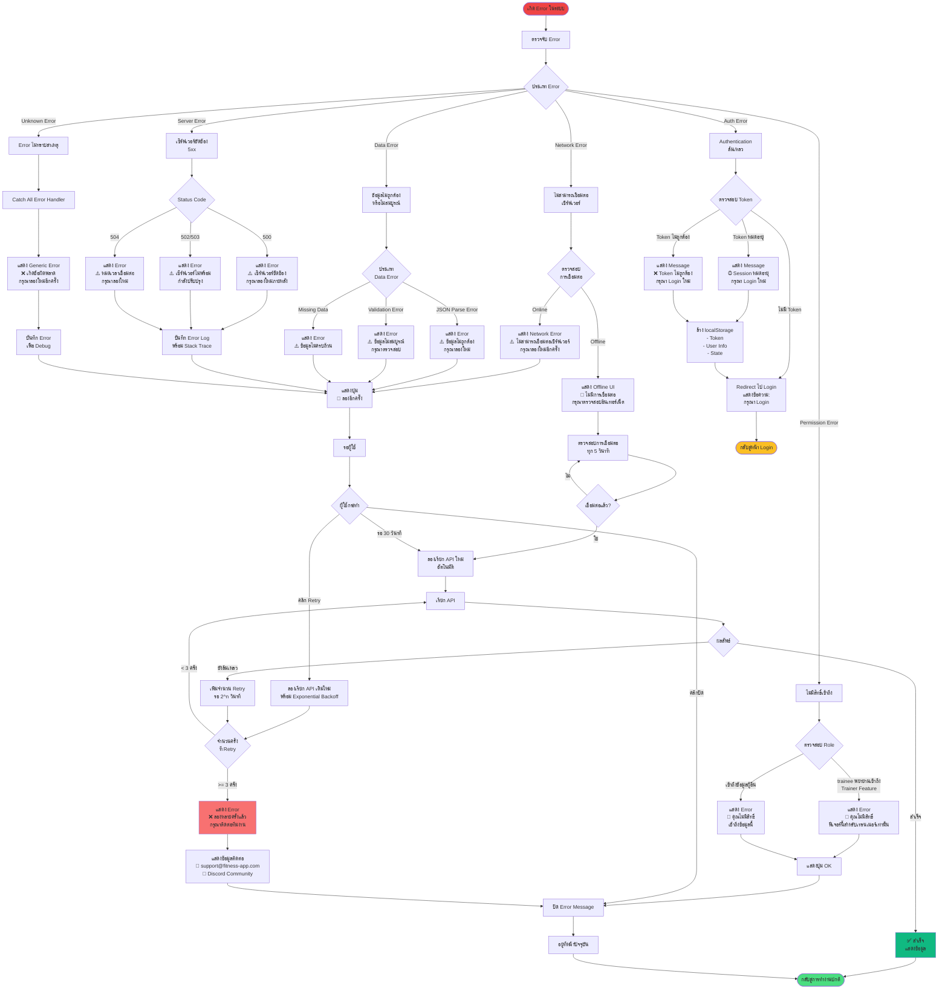

---

## 🎨 UI/UX Flow Patterns

### Loading States

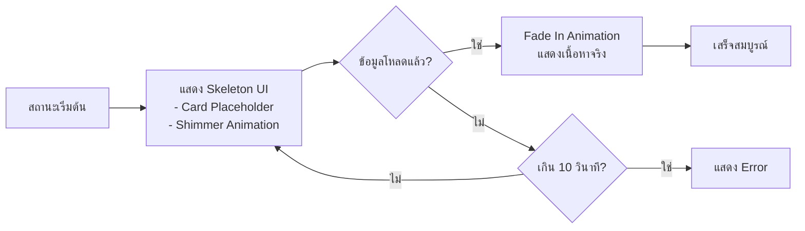

### Theme Toggle

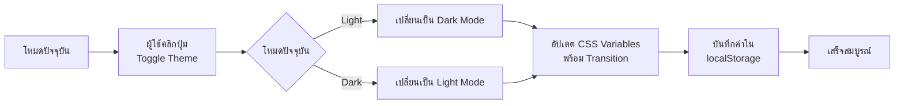

### Scroll Behavior

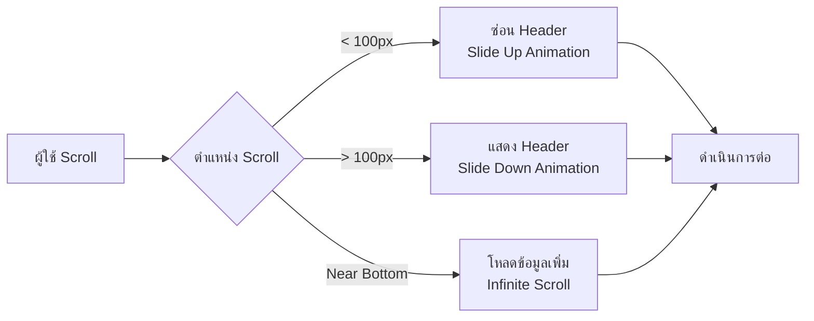

---

## 📱 Responsive Breakpoints

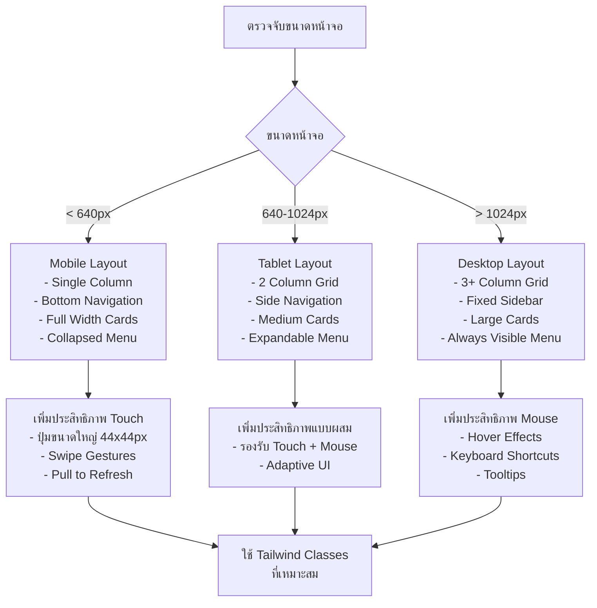

---

## 🔄 Data Synchronization

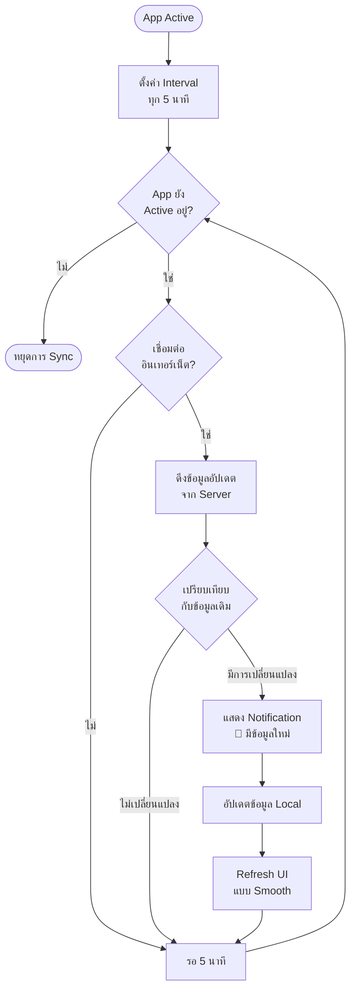

---

## 🎯 Key Features Summary

### ✅ READ-ONLY Features (Trainee)

1. **ดูตารางนัดหมาย** - กรองตามวันที่, แสดง Badge สถานะ
2. **ดูความก้าวหน้า** - กราฟ, ตาราง, สถิติ 3 ประเภท
3. **ดูการ์ดสรุปผล** - คำแนะนำจากเทรนเนอร์
4. **ดูโปรไฟล์** - ข้อมูลส่วนตัว, ตั้งค่า
5. **ดูแจ้งเตือน** - การแจ้งเตือนจากระบบ
6. **ค้นหาข้อมูล** - ค้นหาท่า, วันที่, เทรนเนอร์

### 🚫 Restrictions (Trainee)

- ❌ ไม่สามารถสร้างโปรแกรม
- ❌ ไม่สามารถแก้ไขข้อมูล
- ❌ ไม่สามารถลบข้อมูล
- ❌ ไม่สามารถสร้างการ์ดสรุป
- ❌ ไม่สามารถบันทึกผลการฝึก

---

## 📞 Support Information

**Created by**: Figma Make AI Assistant  
**Date**: 23 มกราคม 2026  
**Version**: 1.0.0  
**Status**: ✅ Complete

**Contact**:
- Email: support@fitness-app.com
- Discord: Fitness App Community
- GitHub: fitness-management-system

---

## 🎉 Conclusion

Flowchart นี้ครอบคลุมการทำงานของระบบฝั่งลูกเทรน (Trainee Dashboard) ทั้งหมด ตั้งแต่:

1. ✅ Authentication Flow - Login ผ่าน Google
2. ✅ Dashboard Overview - โครงสร้างหลัก
3. ✅ Schedule View - ตารางนัดหมาย
4. ✅ Progress View - ความก้าวหน้า 3 ประเภท
5. ✅ Session Cards View - การ์ดสรุปผล
6. ✅ Demo Data Flow - สร้างข้อมูลตัวอย่าง
7. ✅ Error Handling - จัดการข้อผิดพลาด
8. ✅ UI/UX Patterns - Responsive, Theme, Loading

ระบบออกแบบมาเพื่อให้ลูกเทรนสามารถ **ดูข้อมูลได้อย่างเดียว (READ-ONLY)** และมีประสบการณ์การใช้งานที่ดี ปลอดภัย และตอบสนองได้รวดเร็ว! 🚀
